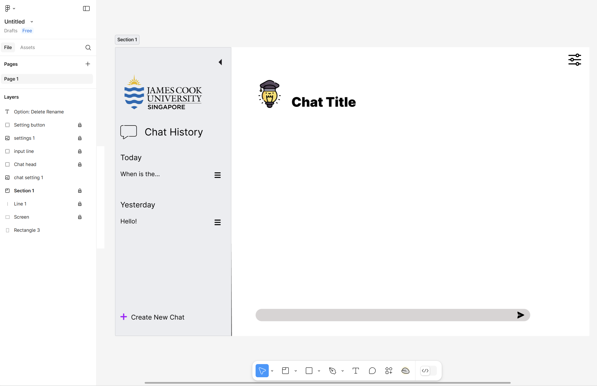
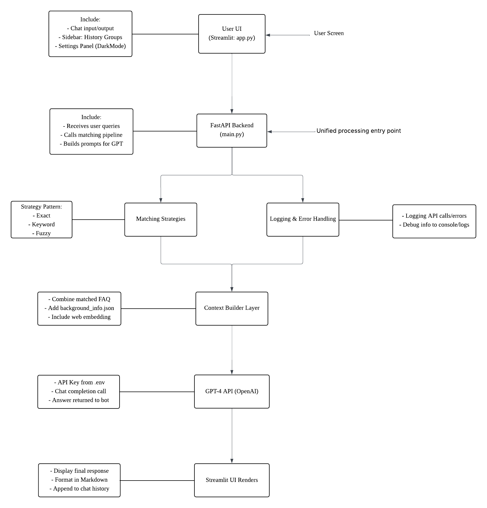
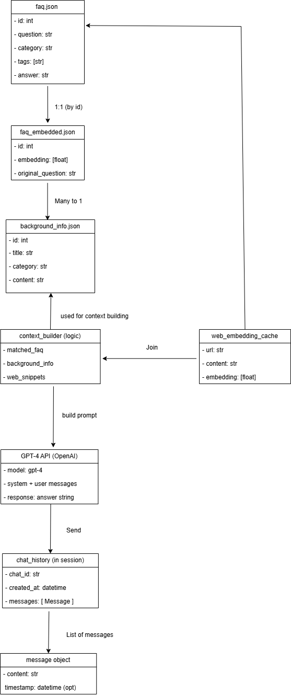

# Design Page Of All Major Component

## 1.Interface Design

### Figure 1

### Figure 2

### Figure 3

### Link: https://www.figma.com/design/AFX0cQK0eej9ODTBOpqGl3/Untitled?node-id=0-1&p=f&t=GpGWj8nEmXb3Kbvo-0

### Explain:
Figure 1 shows the overall layout design of the chatbot's main interface. On the left side is the 'Chat History' area, where users can browse their conversation history for today ('Today') and yesterday ('Yesterday'), and initiate new conversations via the 'Create New Chat' button. In the top right corner of the 'Chat History' area, there is a collapse/expand arrow (or zoom arrow), which allows users to expand and close the 'Chat History' area. The right side is the chat area, with the title indicated as 'Chat Title'. Below the title is a grey chat input box where users can type. In the top right corner of the screen, there is a settings button that users can use to adjust page settings and features.

Figure 2 shows the settings button for a 'single chat option'. By clicking it, users can expand a settings menu to perform 'Rename' and 'Delete' operations on the chat option.

Figure 3 displays the available page settings button. By clicking it, users can expand a settings menu to adjust page settings and access open functionalities. The design includes four options:
- `Dark Mode`: Allows users to toggle night mode.
- `Browser Notification`: Allows the website to send push notifications to users.
- `Link @JCU`: Provide association with university email.
- `Connect Us`: Allow users to contact the school via email.

## 2.Architectural Design

### Link: https://lucid.app/lucidchart/6bfd0a77-3a80-4ba3-aa89-103cb32ac820/edit?beaconFlowId=609390DDB045F377&invitationId=inv_af40d4db-185b-4915-a071-246e2c6679e0&page=0_0#

### Explain:

1. User UI (Streamlit: app.py):  
The user interface serves as the interaction entry point for the entire system. Implemented using Streamlit, it offers a clean and visual chat window. Users can input questions, view chat history, toggle settings, and access past chat logs via the left sidebar, grouped by 'Today' and 'Yesterday'. The interface also includes a 'Create New Chat' button to initiate new conversations. All user actions are ultimately sent as API requests to the backend FastAPI interface for processing.

2. FastAPI Backend (main.py):  
The backend service is built with FastAPI, acting as a bridge between the frontend and the core logic. It receives user requests from the frontend and orchestrates subsequent processes in a unified manner. Its main responsibilities include: cleaning user input, invoking matching strategy modules (Exact / Keyword / Fuzzy), organizing context information, constructing the GPT Prompt and sending it to the OpenAI API, as well as handling exceptions and error messages within the requests. The FastAPI backend is the central core for the entire system's logical operation.

3. Matching Strategies (Strategy Pattern):  
It includes three matching methods:  
- `ExactMatchStrategy`: Precisely matches user questions with FAQ questions.  
- `KeywordMatchStrategy`: Performs partial matching after extracting keywords.  
- `FuzzyMatchStrategy`: Performs fuzzy matching using similarity algorithms.

4. Logging & Error Handling:  
To enhance the system's maintainability and stability, the backend includes a dedicated logging and error handling module. Its main functionalities include: recording API request logs, capturing exceptions, and outputting debugging information to the console or log files. This module ensures that when issues arise during system operation, developers can quickly locate and resolve errors.

5. Context Builder Layer:  
This layer is responsible for integrating all available information into a comprehensive Prompt for the GPT model to reference. Its data sources include:  
- `Matched FAQ answer`  
- `background_info`  
- `Real-time web embedding`

6. GPT-4 API (OpenAI):  
The system's intelligent question answering is powered by GPT-4. After integrating all contextual information, FastAPI calls OpenAI's Chat Completion API, passing system instructions and the user's question to generate a natural language answer.

7. Streamlit UI Renders (Answer Display):  
The generated responses are rendered and displayed by the frontend Streamlit UI. This module formats the GPT output into Markdown style for user viewing and appends it to the current chat history, ensuring conversation continuity.

## 3.Database Design

### Explain:

1. faq.json: This file stores the system's core FAQ dataset, including each question, its answer, category, and tags. It serves as the primary source for exact, keyword-based, and fuzzy matching strategies. Each record has a unique "id" that allows for direct referencing across modules.

2. faq_embedded.json: This file stores the embedding vectors for each FAQ question, generated using OpenAI’s embedding API. These vectors enable semantic similarity comparisons between user input and stored questions. Each entry shares the same "id" as in "faq.json" , establishing a direct one-to-one link.

3. background_info.json: This file contains structured background content such as enrollment procedures, email setup guides, and accommodation information. Each record includes a "title", "content" and "category". These entries are used to enrich the prompt sent to GPT, providing useful context.

4. context_builder: This is a logical component rather than a stored file. It dynamically assembles data from the matched FAQ, background information, and optional web content into a single GPT prompt. This step ensures the model has all the necessary context to generate a high-quality response.

5. web_embedding_cache: This optional cache stores snippets from external web pages and their embeddings. It's used when relevant information is not available in the local FAQ or background files. The cache helps the system respond to less common or more up-to-date queries using real-time web content.

6. GPT-4 API: he final prompt is passed to the GPT-4 model via OpenAI’s Chat Completion API. It includes the system instructions, the full context, and the user's current input. The model returns a natural language answer, which is then sent back to the frontend for display.

7. chat_history: This module stores temporary chat data in Streamlit’s session state. Each chat includes a unique "chat_id", a timestamp, and a list of message objects.

8. message object: Each message within a chat session includes the role (user or bot) and the content of the message. Optionally, it can include a timestamp. Together, these messages form a full conversation history that is displayed in the UI in a sequential manner.

