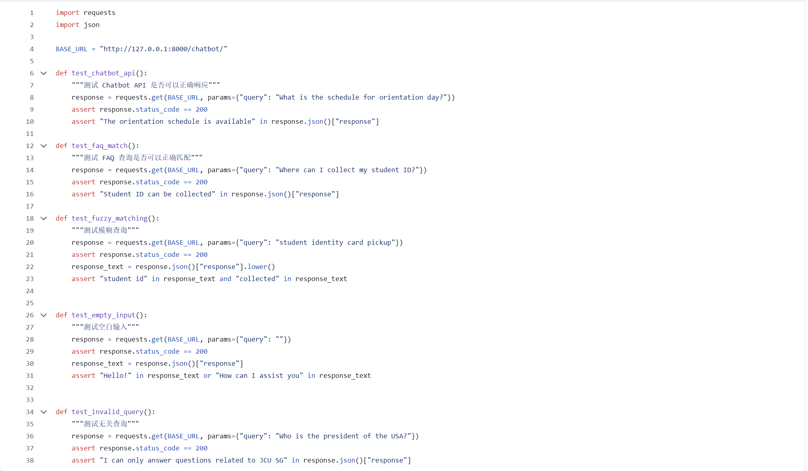
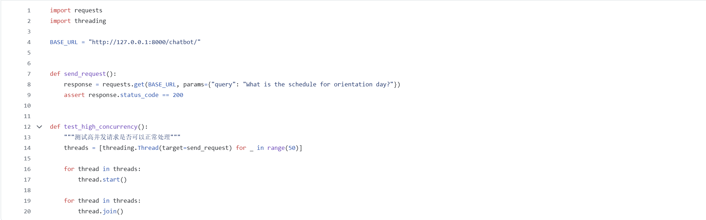
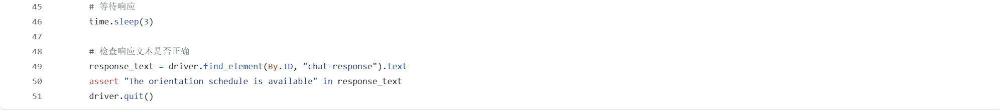
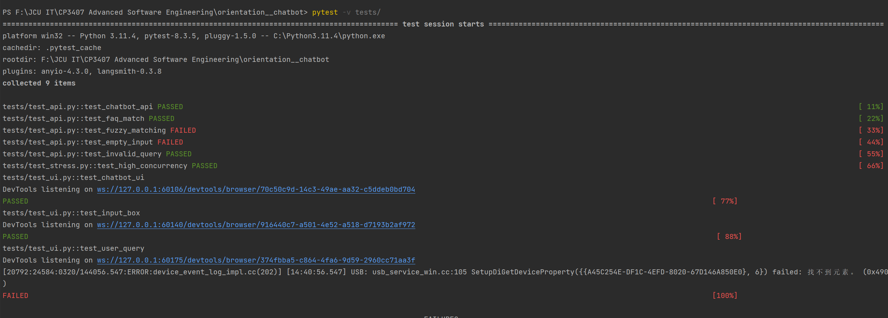
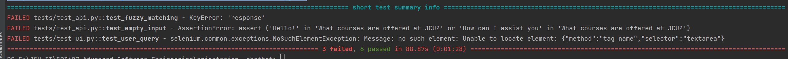
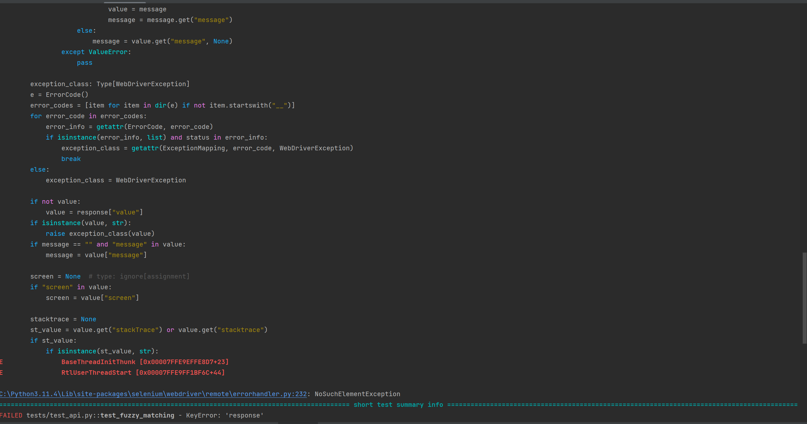
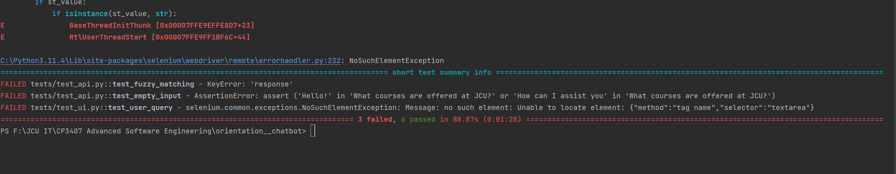

# CP 3407 Week 7

## Activity One

---

### User story 1
As a [new student], I want to ask the chatbot various types of questions about Orientation Week,  
so that I can get accurate and relevant information quickly without needing to follow a fixed query format.

---

#### Test Case 1.1: Use informal language for the query

**Test Objective:**  
Input: "What activities are there during Freshers' Week?"  
(Note: Use “Freshers’ week” not the term “orientation week”.)

**Expected Output:**
- The chatbot recognizes that 'Freshers Week' refers to Orientation Week and returns relevant information
- The output should be similar to that provided for formal inquiries, ensuring users receive consistent information regardless of whether they use formal or informal language.

**Test Output:**  

---

#### Test Case 1.2: Fuzzy Query

**Test Objective:**  
Input: "What's on Monday?"

**Expected Output:**
- The chatbot should recognize that the user is inquiring about the activities on Monday during Orientation Week and provide the specific schedule for that day.
- The chatbot can optionally include a link to the complete schedule, allowing users to view information for other days.

**Test Output:**  

---

#### Test Case 1.3: Handling Misspellings

**Test Objective:**  
Input: "Could you give me the chack livt in 'Orintation Weak'"

**Expected Output:**
- The chatbot recognizes the misspelling and corrects it.
- Provides the Orientation Week checklist.

**Test Output:**  

---

### User story 2
As a [new student], I want the chatbot to provide real-time updates  
so that I can be sure I have the most current information and avoid any problems caused by outdated details.

---

#### Test Case 2.1: Chatbot Provides Up-to-Date Data

**Test Objective:**
- Ensure chatbot delivers the latest Orientation Week info (not cached or outdated).

**Expected Output:**
- Info source should be current (maintained by admin).
- Provided data should reflect the most recent info at the query date.

**Test Output:**  
  

---

#### Test Case 2.2: Multi-Channel Data Synchronization

**Test Objective:**
- Verify chatbot syncs updates from multiple sources (e.g., school site, social media).

**Expected Output:**
- Chatbot integrates latest website data.
- Provides a “Click here for full schedule” link.

**Test Output:**  

---

#### Test Case 2.3: API Disconnection Handling

**Test Objective:**
- Ensure chatbot can answer pre-written FAQs even without API connection.

**Expected Output:**
- Chatbot uses FAQ database to reply.
- Once API reconnects, resumes live updates.

**Test Output:**  
  

---

## Activity Two

### **Code files:**

- ### Test_api.py  
  

- ### Test_stress.py  
  

- ### Test_ui.py  
    
  

### **Output:**  
  
  
  
  
  

