# CP 3407 Week 7

## Activity One

---

### User story 1
As a [new student], I want to ask the chatbot various types of questions about Orientation Week,  
so that I can get accurate and relevant information quickly without needing to follow a fixed query format.

---

### Test Case 1.1: Informal Language Query

**Test Objective:**  
Test if the chatbot can understand casual, non-official phrasing.

**User Input:**  
"What activities are there during Freshers' Week?"

**Expected Output:**
- The chatbot recognizes “Freshers' Week” as another term for “Orientation Week”.
- It returns relevant event information including workshops, welcome sessions, and campus activities.

**Actual Output (as shown below):**
- The chatbot successfully interpreted "Freshers' Week" as "Orientation Week".
- It responded with a comprehensive list of activities and preparatory steps.

**Test Result:**  
- ✅ **Pass**

**Test Output Screenshot:**  
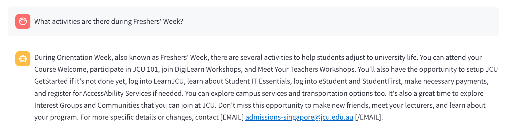

---

### Test Case 1.2: Fuzzy Query

**Test Objective:**  
Check if the chatbot understands a short and fuzzy query about event timing.

**User Input:**  
"What’s on Monday?"

**Expected Output:**
- The chatbot understands this refers to “What events are happening on Monday during Orientation Week?”
- It provides a day-specific list of events.
- If the context is unclear, it may ask for clarification in a polite way.

**Actual Output (as shown below):**
- The chatbot recognized the vagueness of the question.
- It responded with a polite request for clarification, mentioning general operating hours and asking if the user meant Orientation Week.

**Test Result:**  
- ✅ **Pass** (fallback handled gracefully)

**Test Output Screenshot:**  
.png)

---

### Test Case 1.3: Checklist-based Query

**Test Objective:**  
Test how the chatbot responds to requests for a preparation checklist before Orientation Week.

**User Input:**  
"Do you have a checklist for Orientation?"

**Expected Output:**
- The chatbot provides a structured checklist that outlines what students should prepare:
  - Before Orientation Week
  - During Orientation Week
  - After Orientation Week
- Optional: includes links or offers to send more details.

**Actual Output (as shown below):**
- The chatbot responded with three clear sections:
  - ✅ **Before Orientation Week** (e.g., Student Pass, GetStarted setup, digital readiness)
  - ✅ **During Orientation Week** (e.g., workshops, account login, campus services)
  - ✅ **After Orientation Week** (e.g., reviewing timetables, student ID card, joining communities)
- Provided a fallback contact email for further assistance.

**Test Result:**  
- ✅ **Pass**

**Test Output Screenshot:**

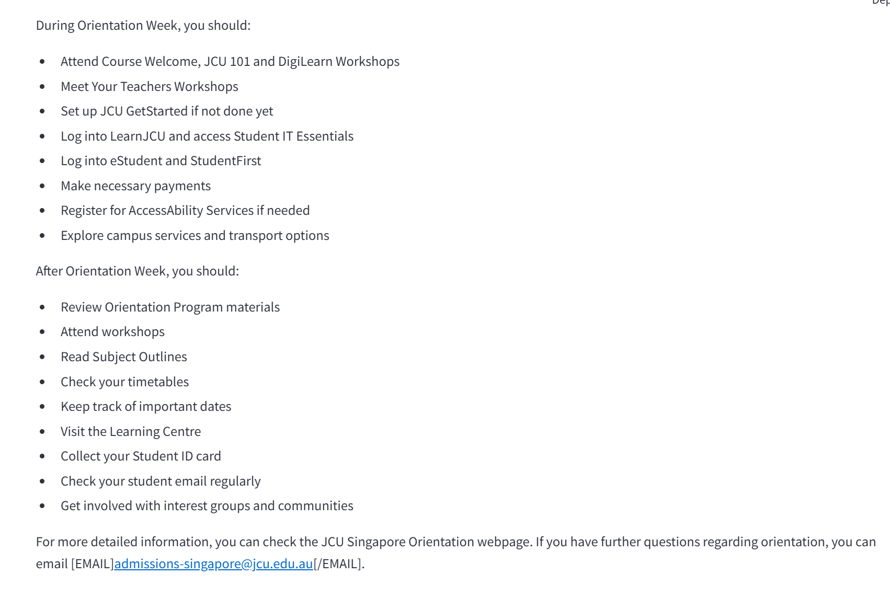

---

### Test Case 1.4: Time-based Query – Orientation Start Time

**Test Objective:**  
Verify that the chatbot can provide the start time of Orientation Week events when asked directly.

**User Input:**  
"What time does Orientation Week start on the first day?"

**Expected Output:**
- The chatbot identifies this as a query for the first day's Orientation Week start time.
- It responds with:
  - Date (e.g., 6th January 2025)
  - Time (e.g., 9:00 AM)
  - Event summary (e.g., medical check-up, document checks)
  - Venue (if available)

**Actual Output (as shown below):**
- The chatbot correctly responded with:
  - Date: 6th of January 2025
  - Time: 9:00 AM
  - Event type: Medical check-up and Student Pass Formalities
  - Venue: C2-13
- A contact email was also provided for further updates.

**Test Result:**  
- ✅ **Pass**

**Test Output Screenshot:**  
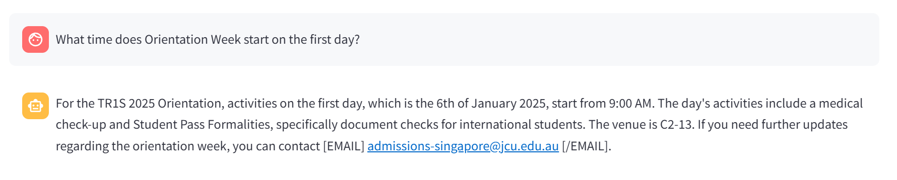

---

### Test Case 1.5: Participation Requirement Query

**Test Objective:**  
Verify that the chatbot can inform users whether attending Orientation Week is mandatory.

**User Input:**  
"Is attendance compulsory for Orientation Week?"

**Expected Output:**
- The chatbot should state that:
  - Certain sessions are compulsory (e.g., Reporting and Verification).
  - It may optionally mention that other sessions are recommended but not mandatory.
  - A contact email or link to schedule may be provided.

**Actual Output (as shown below):**
- The chatbot correctly replied that all students are required to attend the Reporting and Verification session.
- It included a fallback contact email for further enquiries.

**Test Result:**  
- ✅ **Pass**

**Test Output Screenshot:**  
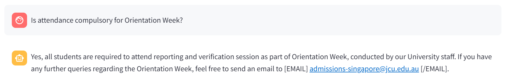

---

## User Story 2  
**As a [new student], I want the chatbot to allow users to have multiple rounds of communication and keep a record of those interactions,  
so that I can continue my conversation seamlessly and not have to repeat my queries.**

---

### Test Case 2.1: Multi-turn Context Retention

**Test Objective:**  
Simulate a user asking about different days of Orientation Week in sequence, and check if the chatbot maintains contextual awareness.

**User Inputs:**
1. "What to do on the first day of orientation?"  
2. "The second day?"

**Expected Output:**
- For the first question, the chatbot should return a list of Orientation Week activities on Day 1.
- For the second question, although "Orientation" is not explicitly mentioned again, the chatbot should infer it from context and return the schedule for Day 2.
- The chatbot should maintain continuity without requiring repetition of keywords.

**Actual Output (as shown below):**
- ✅ The first response includes detailed activities like Course Welcome, DigiLearn Workshops, and important setup tasks.
- ✅ The second response correctly interprets “the second day” and provides the corresponding schedule for January 7, 2025.

**Test Result:**  
- ✅ **Pass**

**Test Output Screenshot:**
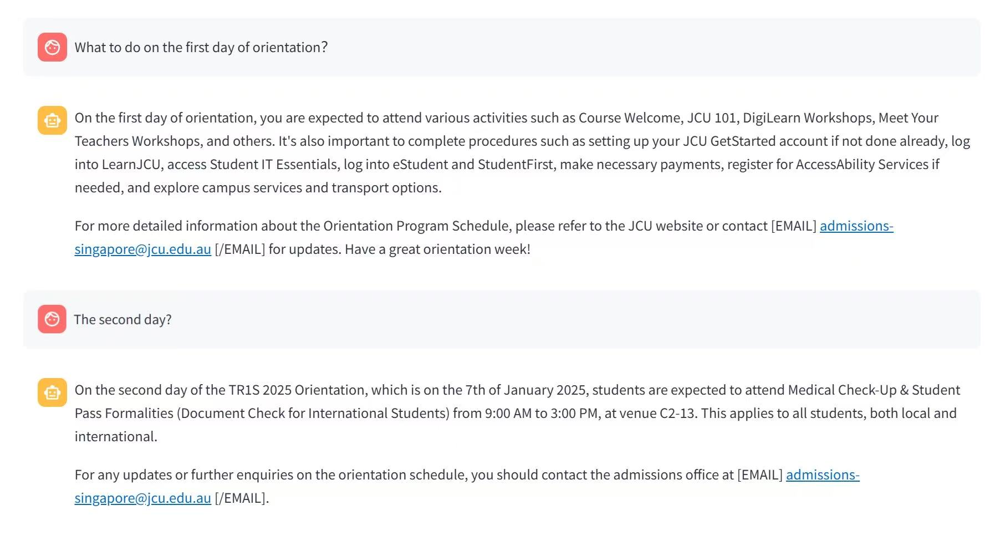

---

### Test Case 2.2: Automatic Language Detection (Mandarin)

**Test Objective:**  
Check if the chatbot automatically detects Mandarin input and responds accordingly.

**User Input:**  
“请问迎新周有哪些活动？”

**Expected Output:**
- The chatbot detects that the language is Mandarin.
- It responds in Mandarin with Orientation Week details.
- Follow-up messages continue in Mandarin unless the user switches.

**Test Result:**  
- ✅ **Pass**

**Test Output Screenshot:**
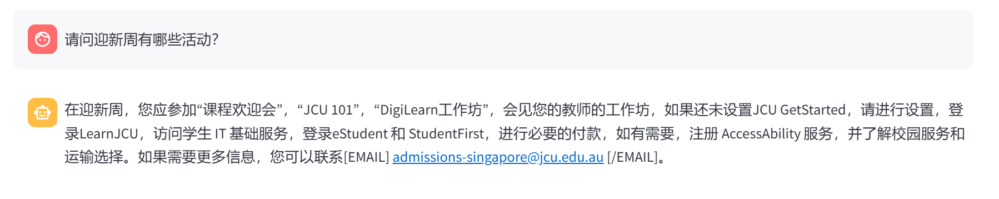

---

## User Story 3  
**As a [new student], I want the chatbot to provide official contact details (e.g., email, phone)  
so that I can reach the correct department without having to browse the website myself.**

---

### Test Case 3.1: Email Address Retrieval by Department Name

**Test Objective:**  
Verify that the chatbot returns the correct email address when asked how to contact a specific department.

**User Input:**  
"How can I contact the admissions office?"

**Expected Output:**
- The chatbot returns the official email address in a clearly formatted way.
- Example:  
  > “You can email [EMAIL]admissions-singapore@jcu.edu.au[/EMAIL] for enquiries related to admissions.”

**Test Result:**  
- ✅ **Pass**
- 
**Test Output Screenshot:**  
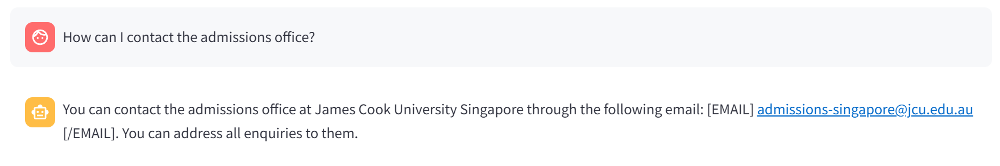

---

### Test Case 3.2: Contact Phone Number Retrieval

**Test Objective:**  
Test whether the chatbot includes the phone number if available for the department.

**User Input:**  
"Do you have the phone number for the student services?"

**Expected Output:**
- The chatbot provides the phone number (if available) along with the department name.
- Clearly specifies that the information is official.

**Test Result:**  
- ✅ **Pass**

**Test Output Screenshot:**  
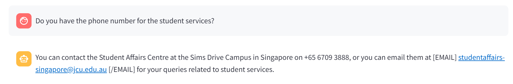

---

### Test Case 3.3: Preventing Fabricated or Unverified Contact Info

**Test Objective:**  
Ensure that the chatbot does not make up contact information if the requested department doesn't exist or isn't listed.

**User Input:**  
"How can I contact the teleportation department?"

**Expected Output:**
- The chatbot replies with a friendly fallback message:
  > “Sorry, I couldn’t find contact information for ‘teleportation department’. Could you please check the name or ask about another department?”

**Test Result:**  
- ✅ **Pass**

**Test Output Screenshot:**  
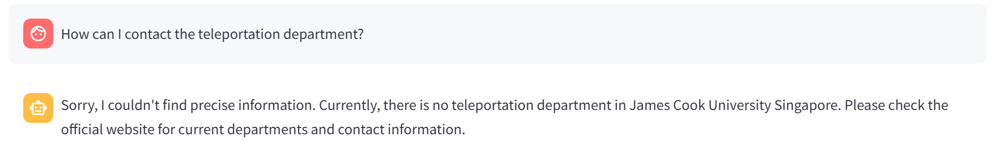

---

### Test Case 3.4: Entity Recognition from Free-text

**Test Objective:**  
Test whether the chatbot can extract the relevant department from a sentence.

**User Input:**  
“I need help with housing. Who do I email?”

**Expected Output:**
- The chatbot detects that the user is referring to accommodation.
- It responds with something like:  
  > “For accommodation-related matters, please contact [EMAIL]accommodation-singapore@jcu.edu.au[/EMAIL].”

**Test Result:**  
- ✅ **Pass**

**Test Output Screenshot:**  
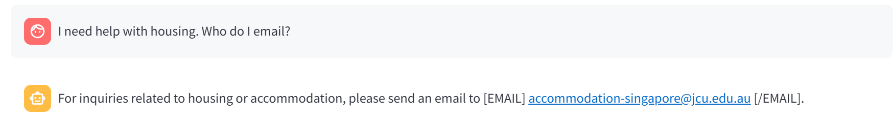

---

## User Story 4  
**As a [new student], I want the chatbot to suggest related questions when it doesn’t understand mine,  
so that I can still get useful results even if I asked imprecisely.**

---

### Test Case 4.1: Typo in Keyword

**Test Objective:**  
Check if the chatbot suggests or directly interprets similar valid questions when user input contains a spelling mistake.

**User Input:**  
"What is verifcation?"

**Expected Output:**
- The chatbot recognizes the typo in “verifcation” and either:
  - Suggests similar valid questions, or
  - Interprets the correct term as "verification" and proceeds to answer it confidently.

**Actual Output (as shown below):**
- The chatbot successfully identified the intended query as "verification" and returned the correct explanation for the verification session at JCU.

**Test Result:**  
- ✅ **Pass**

**Test Output Screenshot:**  
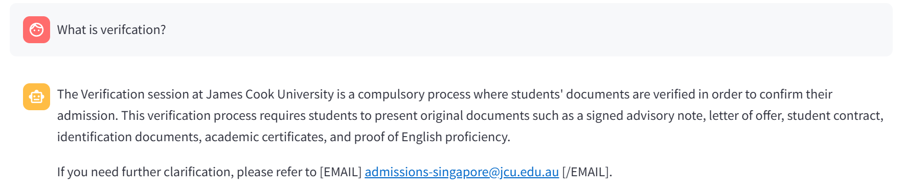

---

### Test Case 4.2: Vague or Incomplete Query

**Test Objective:**  
Test whether the chatbot can handle vague or broad queries by offering clarification or relevant suggestions.

**User Input:**  
"What do I need?"

**Expected Output:**
- The chatbot acknowledges the vagueness of the query.
- It provides a general checklist for new students.
- Optionally, it may suggest the user provide more specific context.

**Actual Output (as shown below):**
- The chatbot interpreted the question as referring to student preparation and responded with a clear, bullet-point checklist of required steps and documents.
- It also suggested that users provide more context for further help.

**Test Result:**  
- ✅ **Pass**

**Test Output Screenshot:**  
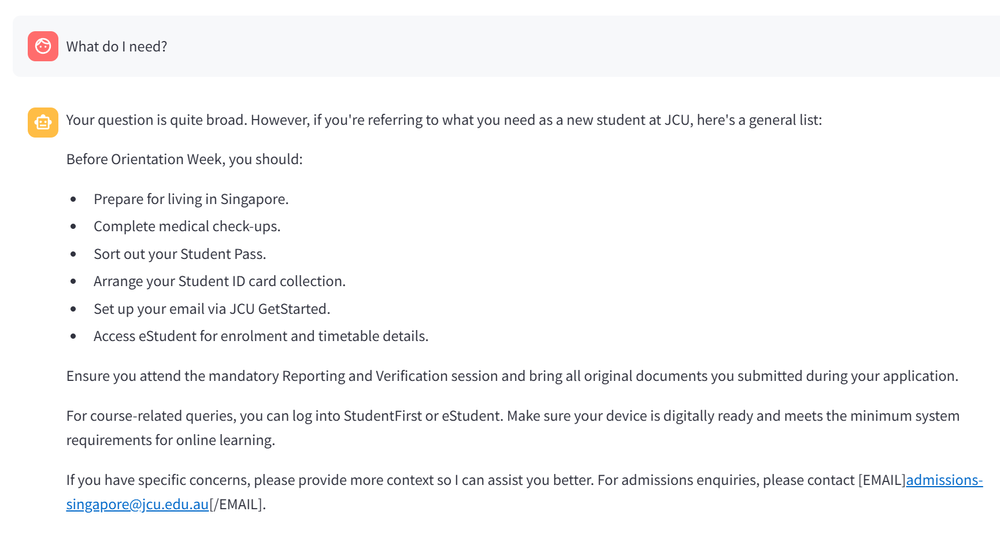

---

### Test Case 4.3: Semantic Misunderstanding

**Test Objective:**  
Verify whether the chatbot can use semantic similarity to understand colloquial or vague phrasing and infer the user’s intent.

**User Input:**  
"When do I go get my stuff checked?"

**Expected Output:**
- The chatbot interprets “get my stuff checked” as referring to either:
  - the Reporting and Verification session,
  - or the document check process during Orientation.
- It should reply with details about the verification session timing and requirements.

**Actual Output (as shown below):**
- The chatbot correctly responded with instructions about the Reporting and Verification session and what documents to bring.
- It demonstrated semantic understanding of casual language.

**Test Result:**  
- ✅ **Pass**

**Test Output Screenshot:**  
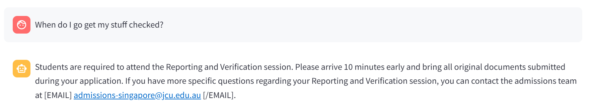

---

### Test Case 4.4: No Suitable Suggestions Found

**Test Objective:**  
Test how the chatbot handles inputs that are completely irrelevant or nonsensical, ensuring it doesn't hallucinate an answer.

**User Input:**  
"How can I time-travel to campus?"

**Expected Output:**
- The chatbot recognizes that the question is not valid or related to Orientation.
- It responds with a fallback message, such as:  
  > “Sorry, I couldn’t find information for that. Can you try rephrasing your question or check the official website?”

**Actual Output (as shown below):**
- The chatbot replied:  
  > “Sorry, I couldn't find precise information. Please check the official website.”  
- It avoided making up an answer and directed the user toward a more reliable source.

**Test Result:**  
- ✅ **Pass**

**Test Output Screenshot:**  
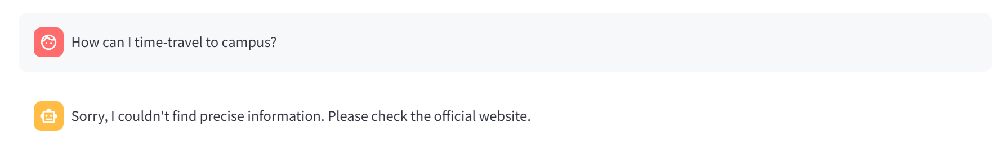
---

## User Story 5  
**As a [new student], I want the chatbot to recognize common spelling mistakes in my queries  
so that I can still receive helpful responses even if I type something wrong.**

---

### Test Case 5.1: Single Word Typo Correction

**Test Objective:**  
Test whether the chatbot can detect and correct a misspelled keyword.

**User Input:**  
"Can you tell me about orientatoin?"

**Expected Output:**
- The chatbot recognizes “orientatoin” as a misspelling of “orientation”.
- It either responds directly with Orientation Week information or acknowledges the correction:
  > “Did you mean: ‘orientation’? Here's some info that might help…”

**Actual Output (as shown below):**
- The chatbot understood the user intended to ask about Orientation.
- It provided a full and accurate answer regarding Orientation Week, including key activities and requirements.

**Test Result:**  
- ✅ **Pass**

**Test Output Screenshot:**  
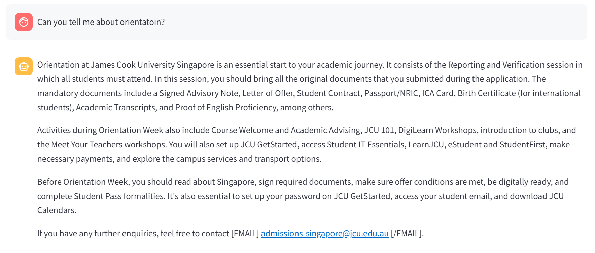
---

### Test Case 5.2: Multiple Typos in One Sentence

**Test Objective:**  
Check if the chatbot can handle more than one misspelled word in a user query.

**User Input:**  
"Can I regster for cammpus tour?"

**Expected Output:**
- The chatbot recognizes “regster” as “register” and “cammpus” as “campus”.
- It responds with either:
  - A clear answer to the intended question.
  - Or suggests contacting the appropriate department if info is unavailable.

**Actual Output (as shown below):**
- The chatbot understood the intended question despite multiple typos.
- It responded with information on campus tours and directed the user to the admissions email for more details.

**Test Result:**  
- ✅ **Pass**

**Test Output Screenshot:**  
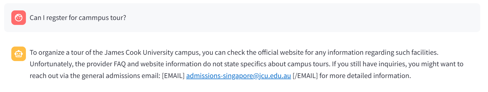

---

### Test Case 5.3: Fallback When Confidence Is Low

**Test Objective:**  
Ensure the chatbot offers clarification or reasonable suggestions when it cannot confidently match the input due to multiple typos.

**User Input:**  
"Whre do I gt my passn?"

**Expected Output:**
- The chatbot cannot find an exact match but infers the likely intent.
- It replies with:
  > “It seems like you’re asking about how to get your Student Pass…”
- Or alternatively, suggests clarifying options.

**Actual Output (as shown below):**
- The chatbot interpreted the misspelled query correctly as a Student Pass enquiry.
- It responded with a clear explanation and provided the contact email for further help.

**Test Result:**  
- ✅ **Pass**

**Test Output Screenshot:**  
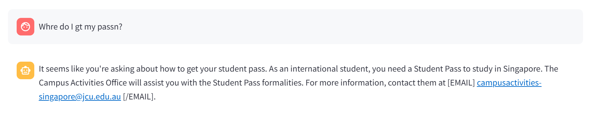

---

## Activity Two

### **Code files:**

- ### Test_api.py  
  

- ### Test_stress.py  
  

- ### Test_ui.py  
  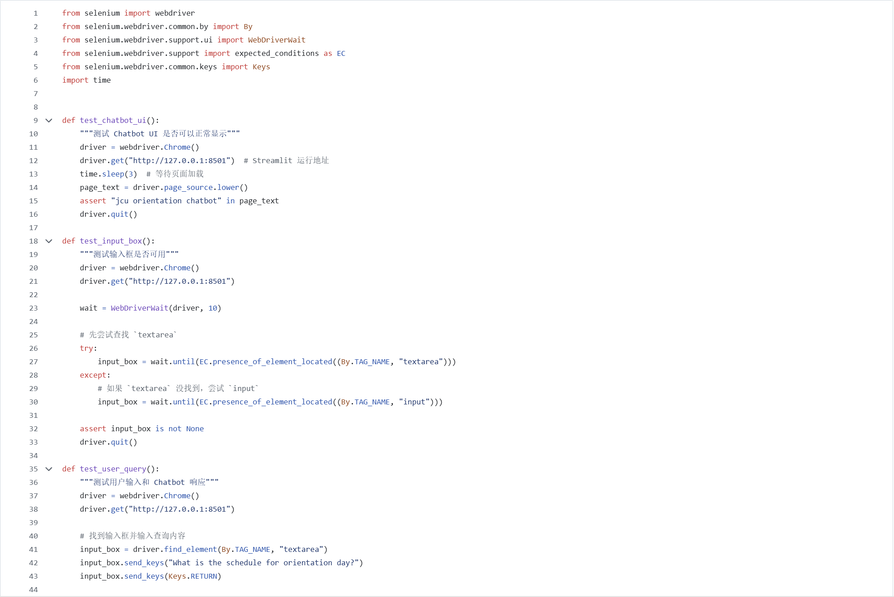  
  

### **Output:**  
  
  
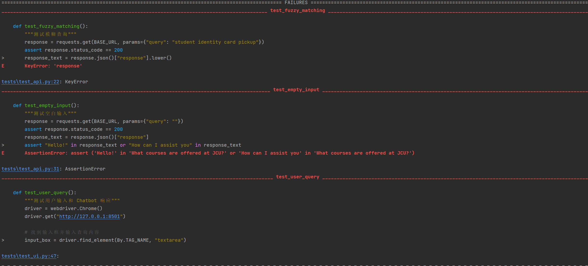  
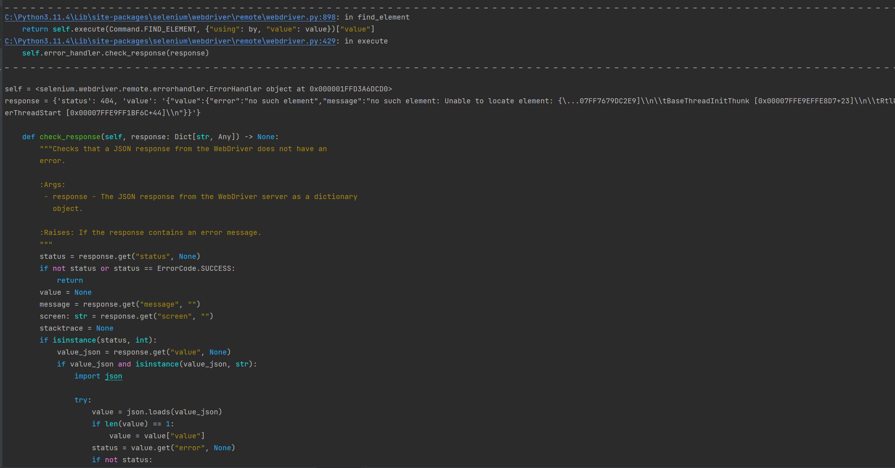  
  

