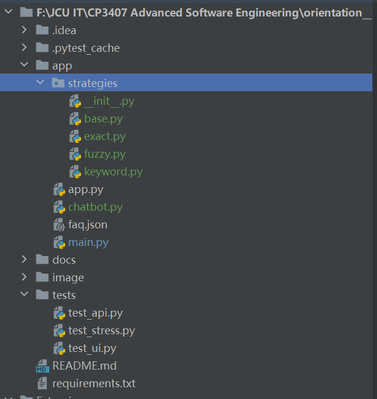
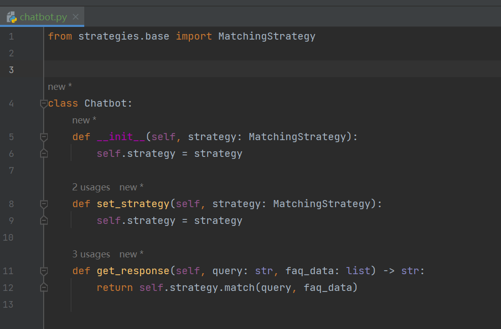
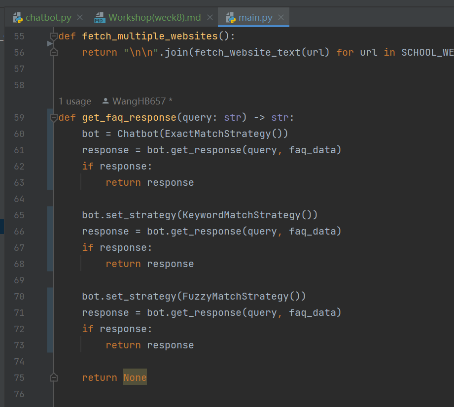
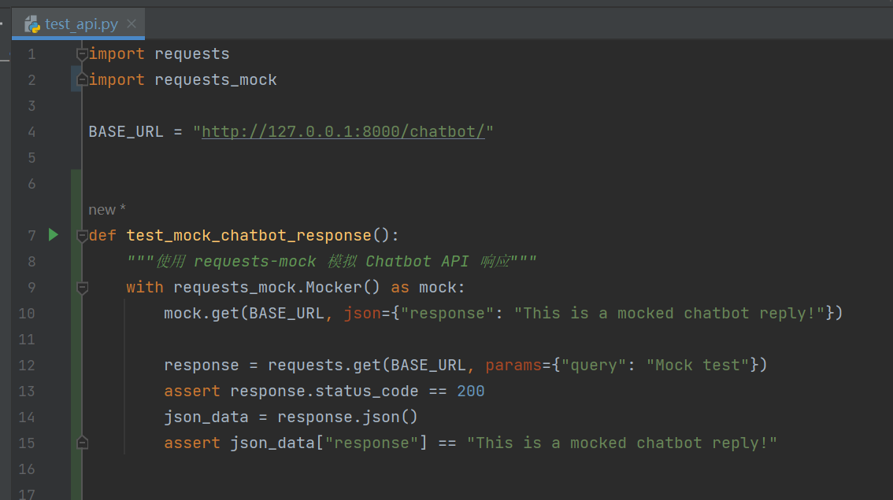
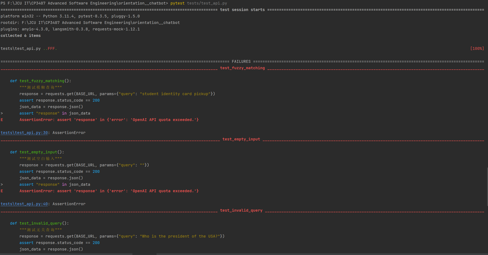
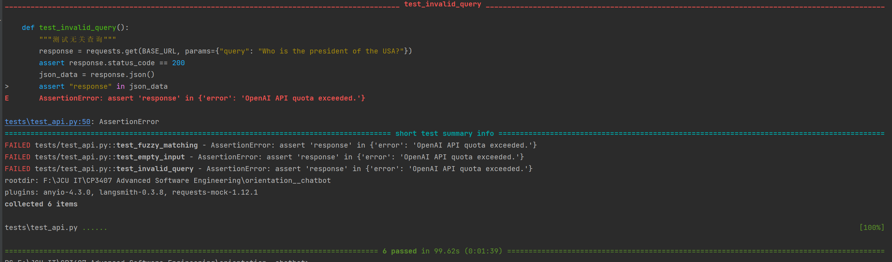

# Workshop 8 Report

---

## Activity One: Strategy Pattern Research & Application

---

### ✅ Application in My Project

In my chatbot project, I use the Strategy Pattern to determine **how to match user queries to stored FAQ entries**.

#### 👇 Implemented Matching Strategies:

| Strategy              | Purpose                            |
|-----------------------|-------------------------------------|
| `ExactMatchStrategy`  | Matches query exactly with FAQ      |
| `KeywordMatchStrategy`| Matches based on word intersections |
| `FuzzyMatchStrategy`  | Uses similarity ratio (e.g. typos)  |

---

### 📁 Folder Structure

### 

# Workshop 8 - Activity Two Mock Object Framework Research & Application

---

## 🔍 What is a Mock Object?

A **Mock Object** is a fake version of a real object used in testing. It simulates the behavior of complex, real-world dependencies (such as databases, HTTP APIs, or third-party services) so that we can run tests **faster**, **more reliably**, and **without real-world side effects**.

---

## 🧪 Mock Usage in My Project

My project uses FastAPI for backend APIs and calls external services like OpenAI. To test my API endpoints efficiently, I used the `requests-mock` framework to **simulate a chatbot response** without needing the actual server running.

