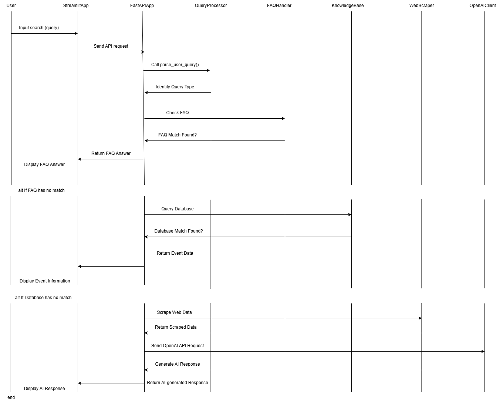

# **User Story 1: Flexible Event Inquiry**

## **User Story**
As a **[new student]**, I want to ask the chatbot various types of questions about Orientation Week,  
so that I can get accurate and relevant information quickly without needing to follow a fixed query format.

---

## **Acceptance Criteria**
The chatbot should understand and respond to different types of user queries related to Orientation Week, including:

- **General inquiries:**  
  - _Example:_ "Tell me about Orientation Week."  
  - _Response:_ The chatbot provides an overview.

- **Event-based queries:**  
  - _Example:_ "What events are happening on Monday?"  
  - _Response:_ The chatbot lists all events for that day.

- **Location-based queries:**  
  - _Example:_ "Where is the welcome ceremony?"  
  - _Response:_ The chatbot provides location details.

- **Time-based queries:**  
  - _Example:_ "When does the networking session start?"  
  - _Response:_ The chatbot provides event timing.

- **Participation-related queries:**  
  - _Example:_ "Do I need to register for the campus tour?"  
  - _Response:_ The chatbot clarifies registration requirements.

### **Handling Fuzzy Queries**
The chatbot should be able to handle **unclear or flexible queries**, such as:

- _Example:_ "What’s happening this afternoon?"  
  - _Response:_ It should return only **afternoon events**.

- _Example:_ "Are there any fun activities today?"  
  - _Response:_ It should suggest **social events**.

### **Fallback Mechanism**
If an event **does not exist** or **information is missing**, the chatbot should provide a **friendly fallback response** instead of leaving the user without an answer.

### **Input Methods**
The chatbot should support both:
- **Free-text input** (users can type queries freely)
- **Menu-based selection** (predefined options for easier accessibility)

**So that** I can understand the arrangements for Orientation Week in advance and make full preparations.

---

## **Available Deliverables**
- ✅ The chatbot supports **free-text user queries** and understands **different question types**.
- ✅ The chatbot provides a **sorted list of events** for the queried date, including:
  - **Time, Name, Location, Description, Participation details** (e.g., registration required).
- ✅ If users request additional event details, the chatbot should provide **expanded descriptions** upon request.

---

# **Breakdown of Tasks**

## **1️⃣ Design the Chatbot Framework**
**Task:** Complete the basic functionalities of the chatbot.

### **Content:**
- Set up **FastAPI** as the backend.
- Define **API endpoints** to receive user input and return responses.
- Implement **basic conversation flow control** to ensure the chatbot can handle simple interactions.
- Enable the chatbot to have **basic conversation processing capabilities**.
- Allow the chatbot to **detect and interpret user input**.

**Estimate:** **3 days**

---

## **2️⃣ Build a Database to Handle Multiple Types of Query Responses**
**Task:** Ensure the database contains sufficient responses to handle various user queries. Try to ensure that the responses are relevant and match the user’s questions.

### **Content:**
- Create a structured FAQ database.
- Store **different types of queries** (_general, event-based, location-based_).
- The database should include at minimum:
  - **Event Name**
  - **Date & Time**
  - **Location**
  - **Description**

**Estimate:** **7 days**

---

## **3️⃣ User Input Parsing**
**Task:** Design a feature to parse user queries.

### **Content:**
- Implement **natural language processing** to break down user input.
- Detect **key components** such as:
  - **Date**
  - **Event**
  - **Location**
  - **Intent**
- Standardize input to **match the database structure** for accurate results.

**Estimate:** **3 days**

---

## **4️⃣ Keyword Search**
**Task:** Perform a search in the database based on **keywords provided by the user** (_e.g., time, location, event_) to retrieve relevant responses.

### **Content:**
- Implement **keyword extraction** from user input.
- Search the **FAQ or event database** for matches.
- Return **the most relevant event details**.
- Ensure that if **no exact match** is found, **similar results** are provided.

**Estimate:** **2 days**

---

## **5️⃣ Testing & Validation**
**Task:** Test various different questions to ensure the chatbot can provide appropriate responses.

### **Content:**
- **Test responses** for various question types (_time, location, contact information, lists, etc._).
- **Test the retrieval process** from the **FAQ database**.
- **Test scenarios** where the **question does not exist in the FAQ database**.
- **Test keyword-based queries**.

**Estimate:** **2 days**

---

## Class Diagram

---

## Sequence Diagram
